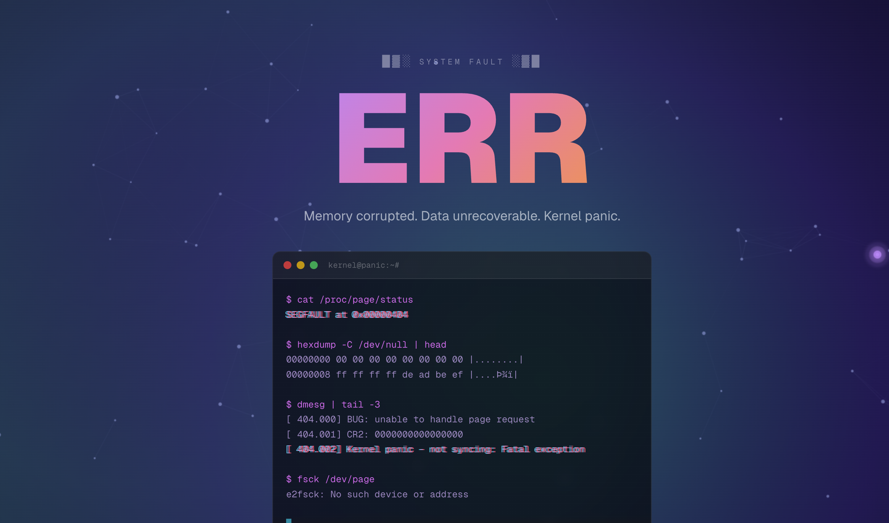
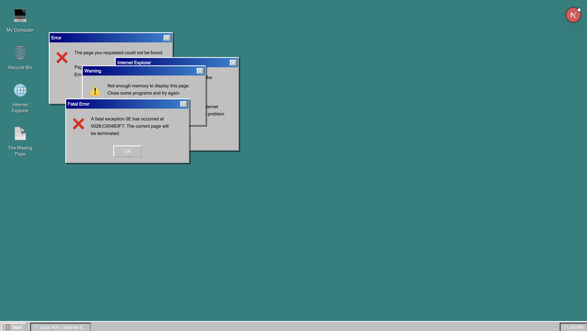

# terminal-not-found

25 creative 404 pages. just pick one  and drop it into your next.js site

built with next.js, tailwind v4, react 19. no external UI libs

  

<p align="center">
  
  
  
</p>

## what's in here

**terminal themes** — animated typing terminal with particles, custom cursor, the whole thing

| theme | route | vibe |
|-------|-------|------|
| Red Team | `/demos/red-team` | hacker pentest output |
| DevOps | `/demos/devops` | kubectl, docker, nginx logs |
| Matrix | `/demos/matrix` | green rain, retro CRT |
| Glitch | `/demos/glitch` | corrupted/distorted everything |
| Space | `/demos/space` | void, stars, deep space |

these all use the customisable `<TerminalNotFound />` component (more on that below)

**non-terminal themes** — completely standalone pages, each one is its own thing

| theme | route | what it does |
|-------|-------|-------------|
| Blue Screen of Death | `/demos/bsod` | windows BSOD, QR code and all |
| Radar | `/demos/radar` | radar sweep animation, sonar pings |
| TV Static | `/demos/static` | canvas noise, channel bars, no signal |
| Classified | `/demos/redacted` | redacted document with █████ blocks |
| Deep Sea | `/demos/deep-sea` | underwater scene, bioluminescent particles, depth gauge |
| Shattered Glass | `/demos/shattered` | screen crack animation |
| Arcade | `/demos/arcade` | retro game over, CRT scanlines, insert coin |
| Windows 95 | `/demos/win95` | cascading error dialogs, start menu, taskbar |
| Maze | `/demos/maze` | playable maze with no exit (arrow keys / WASD) |
| Falling | `/demos/falling` | text falls with gravity, bounces around |
| Ouija Board | `/demos/ouija` | planchette spells out PAGE NOT FOUND |
| Black Hole | `/demos/black-hole` | everything spirals into a singularity |
| Crime Scene | `/demos/crime-scene` | police tape, chalk outline, evidence markers |
| Breaking News | `/demos/breaking-news` | live TV broadcast, scrolling ticker |
| Typewriter | `/demos/typewriter` | old paper, typewriter sound effect vibes, coffee stain |
| Under Construction | `/demos/construction` | 90s geocities energy, marquee, visitor counter |
| Elevator | `/demos/elevator` | floor counter goes to 404, doors open to nothing |
| Loading Forever | `/demos/loading` | progress bar that never finishes, absurd status messages |
| Art Gallery | `/demos/gallery` | 404 framed as modern art with pretentious museum placard |
| Autopsy Report | `/demos/autopsy` | medical examiner report on the dead page |

---

## getting started

### use the whole project

```bash
git clone <this-repo>
cd terminal-not-found
npm install
npm run dev
```

open `localhost:3000` and click around

### just steal a page for your site

honestly the easiest way:

1. pick a demo you like from `app/demos/`
2. copy that `page.js` into your project as `app/not-found.js` (or wherever)
3. add `'use client'` at the top if it isn't already there
4. done

for the terminal themes specifically you'll also need the `components/` folder — just copy the whole thing:

```bash
cp -r components/ your-project/components/
```

and then your `not-found.js` is just:

```jsx
'use client';
import { TerminalNotFound } from '@/components';

export default function NotFound() {
  return <TerminalNotFound />;
}
```

### dependencies

you need:
- next.js 14+ (app router)
- tailwindcss v4
- `lucide-react` — only needed for the terminal component, the standalone pages don't use it

```bash
npm install lucide-react
```

thats literally it

---

## customising the terminal component

the `<TerminalNotFound />` component takes a bunch of props if you wanna tweak it:

```jsx
<TerminalNotFound
  title="BREACH"
  statusText="ACCESS DENIED"
  subtitle="Intrusion detected."
  terminalUser="root@kali: ~"
  homeUrl="/"
  homeLabel="← Retreat"
  accentFrom="#dc2626"
  accentTo="#991b1b"
  gradientColors="135deg, #ef4444, #f97316"
  cursorColor="255, 80, 80"
  showParticles={false}
/>
```

**all props:**

| prop | default | what it does |
|------|---------|-------------|
| `lines` | cybersec preset | array of terminal lines (see below) |
| `title` | `"404"` | big heading |
| `statusText` | `"HTTP 404 — Not Found"` | small text above the heading |
| `subtitle` | `"Host unreachable..."` | text below heading |
| `terminalUser` | `"user@terminal: ~"` | terminal title bar text |
| `homeUrl` | `"/"` | where the back button goes. set to `null` to hide it |
| `homeLabel` | `"← Back to Home"` | back button text |
| `extraActions` | `[]` | more buttons — `[{ href, label, external? }]` |
| `footerText` | error code string | tiny footer text |
| `showBackground` | `true` | the animated gradient blobs |
| `showParticles` | `true` | floating particle constellation |
| `showCursor` | `true` | custom glowing cursor |
| `cursorColor` | `"200, 150, 255"` | RGB string for cursor glow |
| `accentFrom` / `accentTo` | purple | button gradient colours |
| `gradientColors` | purple-cyan | CSS gradient for the title |
| `renderLine` | built-in | custom render fn `(line, i) => JSX` |
| `children` | — | shove whatever you want between terminal and buttons |

### presets

```jsx
import {
  cybersecurityLines, // default — ping, nmap, traceroute
  minimalLines,       // just a curl command
  hackerLines,        // ssh, nmap, hydra
  devopsLines,        // kubectl, docker, nginx
} from '@/components';

<TerminalNotFound lines={hackerLines} />
```

### custom lines

```jsx
const myLines = [
  { delay: 0,    text: '$ whoami' },
  { delay: 600,  text: 'lost_user' },
  { delay: 1200, text: '' },
  { delay: 1400, text: '$ find / -name "this-page"' },
  { delay: 2000, text: 'find: No such file or directory' },
  { delay: 2600, text: '' },
  { delay: 2800, text: '# Page not found.', special: 'red' },
  { delay: 3400, text: '# Try going home.', special: 'green' },
];
```

- `delay` — ms before it appears
- `text` — the text. lines starting with `$` get coloured cyan automatically
- `special` — `'red'` | `'green'` | `'yellow'` | `'cyan'`

---

## project structure

```
app/
  page.js              ← preview/index page with links to everything
  not-found.js         ← default 404 (uses terminal component)
  layout.js            ← root layout with ThemeProvider
  globals.css          ← tailwind + css variables
  demos/
    red-team/page.js
    devops/page.js
    matrix/page.js
    ... (25 demo pages)

components/
  TerminalNotFound.js  ← the main customisable terminal component
  presets.js           ← terminal line presets
  Particles.js         ← floating particle canvas
  LiveBackground.js    ← animated gradient background
  CustomCursor.js      ← glowing cursor
  ThemeProvider.js     ← dark/light mode
  index.js             ← barrel exports
```

## deploying

### vercel (easiest)

push to github → connect to vercel → done. it just works

### anywhere else

```bash
npm run build
npm run start
```

or export as static if you want:

```js
// next.config.mjs
const nextConfig = { output: 'export' };
```

then `npm run build` and deploy the `out/` folder wherever

### using just one page on an existing site

literally just copy the page file you want and rename it to `not-found.js` in your app directory. next.js will automatically use it for 404s. thats the whole process

if youre not using next.js you can still grab the JSX and adapt it — the non-terminal pages are all self-contained with inline styles, no special dependencies

---

## css variables

if you're using the terminal component and want to tweak the base colours:

```css
:root {
  --background: #020712;
  --foreground: #f8fbff;
  --surface: rgba(255, 255, 255, 0.03);
  --border-color: rgba(255, 255, 255, 0.08);
}

.light {
  --background: #f5f7fa;
  --foreground: #1a1a2e;
}
```

---

## license

MIT — do whatever you want with it
